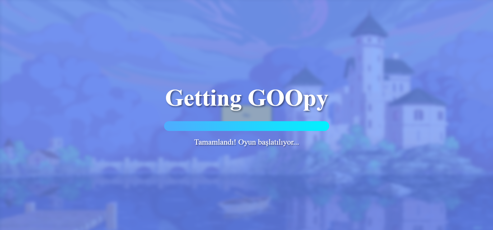
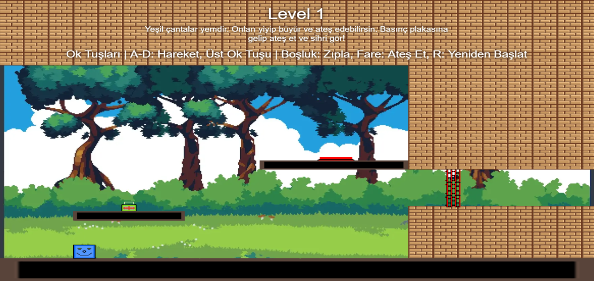
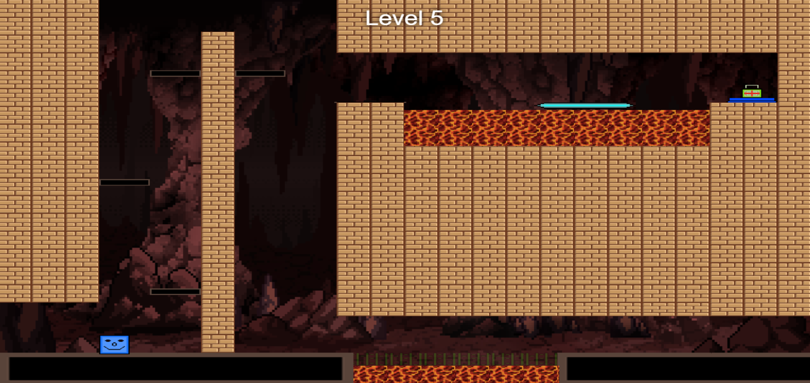

# Getting GOOpy - 2D Platform Oyunu

Oyunun gerçek adı: **Getting Goopy**.
Bağlantı linki ise ``` https://siivergoid.itch.io/getting-goopy ```

**Getting GOOpy**, HTML5 Canvas ve JavaScript kullanılarak geliştirilmiş, eğlenceli bir 2D platform oyunudur. Oyuncular, sevimli bir karakteri kontrol ederek farklı seviyelerde ilerler, yemleri toplar, engelleri aşar ve hedeflere ulaşmaya çalışır. Oyun, fiziksel mekanikler, animasyonlar ve ses efektleriyle zenginleştirilmiştir. Toplamda 5 seviye bulunan bu oyun, hem eğlenceli hem de zorlayıcı bir deneyim sunar.

Bu README dosyası, oyunun nasıl çalıştığını, kurulum adımlarını, oynanış mekaniklerini ve geliştirme sürecinde kullanılan teknolojileri detaylı bir şekilde açıklamaktadır.

## İçindekiler
- [Oyun Hakkında](#oyun-hakkında)
- [Oynanış Mekanikleri](#oynanış-mekanikleri)
- [Kurulum ve Çalıştırma](#kurulum-ve-çalıştırma)
- [Oynanış Videosu](#oynanış-videosu)
- [Seviyeler](#seviyeler)
- [Ekran Görüntüleri](#ekran-görüntüleri)
- [Kullanılan Teknolojiler](#kullanılan-teknolojiler)
- [Geliştirme Notları](#geliştirme-notları)
- [Katkıda Bulunma](#katkıda-bulunma)
- [Kullanılan Kaynaklar](#kullanılan-kaynaklar)
- [Lisans](#lisans)

## Oyun Hakkında
**Getting GOOpy**, oyuncuların bir karakteri yönlendirerek platformlar arasında zıpladığı, yem topladığı ve çeşitli engelleri aştığı bir 2D platform oyunudur. Oyunun temel amacı, her seviyede belirli görevleri tamamlayarak bir sonraki seviyeye ilerlemektir. Karakter, yemleri yiyerek büyüyebilir ve bu yemleri ateş ederek hem engelleri aşabilir hem de geri tepme (recoil) mekaniklerini kullanarak stratejik hareketler yapabilir. Oyun, 5 farklı seviyeden oluşur ve her seviye, farklı platformlar, engeller ve görevlerle oyunculara meydan okur.

## Oynanış Mekanikleri
Oyunda kullanılan temel mekanikler şunlardır:

- **Hareket ve Zıplama**:
  - Ok tuşları veya `A` ve `D` tuşlarıyla karakteri sağa ve sola hareket ettirebilirsiniz.
  - Üst ok tuşu veya `Boşluk` tuşu ile zıplayabilirsiniz.
- **Yem Toplama ve Ateş Etme**:
  - Yeşil çantalar (yemler) karakterin boyutunu büyütür ve ateş etme yeteneği kazandırır.
  - Fare ile tıklayarak yemleri ateş edebilirsiniz. Ateş edilen yemler, basınç plakalarını aktif hale getirebilir veya geri tepme etkisiyle karakterin hareketini etkileyebilir.
- **Basınç Plakaları ve Kapılar**:
  - Basınç plakaları, belirli kapıları (renkli duvarlar) açmak için kullanılır. Plakaların üzerine karakterle veya ateş edilen yemlerle basılarak kapılar aktif/deaktif hale getirilebilir.
- **Engeller**:
  - Tehlikeli duvarlar (hazard walls) karakterin temas etmesi durumunda seviyeyi yeniden başlatır.
  - Hareketli platformlar, dinamik bir oyun deneyimi sunar.
- **Seviye Geçişleri**:
  - Her seviyenin sonunda ekranın sağ kenarına ulaşarak bir sonraki seviyeye geçebilirsiniz.
  - Tüm seviyeler tamamlandığında bir "Tebrikler" ekranı görüntülenir ve oyun yeniden başlatılabilir.
- **Kontroller**:
  - `R`: Seviyeyi yeniden başlatır.

## Kurulum ve Çalıştırma
Oyunu çalıştırmak için aşağıdaki adımları izleyin:

1. **Oyunu tarayıcıda açın**:
   ```
   https://truyak.github.io
   ```
   

2. **Depoyu Klonlayın veya Dosyaları İndirin**:
   ```
   git clone <repo-url>
   ```
   veya projeyi bir ZIP dosyası olarak indirip çıkarın.

**Not**: Oyunun düzgün çalışması için tüm görsel ve ses dosyalarının `assets` klasöründe doğru şekilde yerleştirildiğinden emin olun. Eksik asset'ler konsolda uyarı mesajları oluşturabilir, ancak oyun bu durumda çalışmaya devam eder (fallback mekanizmaları mevcuttur).

## Oynanış Videosu
Oynanış videosuna alttaki linkten erişebilirsiniz.
 ```
  https://www.youtube.com/watch?v=uQNb9vF11Ig
 ```

## Seviyeler
Oyun toplamda 5 seviyeden oluşur. Her seviye, farklı bir harita tasarımı ve görevlerle oyunculara meydan okur:

- **Seviye 1**: Basit bir giriş seviyesi. Oyuncu, temel mekanikleri öğrenir: zıplama, yem toplama ve ateş etme. Basınç plakası ve renkli kapı mekanikleri tanıtılır.
- **Seviye 2**: Geri tepme (recoil) mekaniğini kullanarak stratejik hareketler yapmayı öğretir. Oyuncunun yemi ateş ederek zıplaması ve kapıları açması gerekir.
- **Seviye 3**: Daha karmaşık platformlar ve birden fazla yem içerir. Basınç plakaları ve kapılarla etkileşim artar.
- **Seviye 4**: Çoklu basınç plakaları ve kapılar içerir. Oyuncunun aynı anda birden fazla hedefi yönetmesi gerekir.
- **Seviye 5**: Hareketli platformlar ve tehlikeli duvarlar içerir. Oyuncunun zamanlamayı iyi ayarlaması ve stratejik ateş etme kullanması gerekir.

## Ekran Görüntüleri

### Yükleme Ekranı
Oyun başladığında, oyuncuları şık bir yükleme ekranı karşılar. Yükleme çubuğu ve "Getting GOOpy" başlığı, oyunun temasına uygun bir şekilde tasarlanmıştır.



### Seviye 1
Seviye 1, oyunculara temel mekanikleri öğreten bir giriş seviyesidir. Yeşil çantaları toplayarak karakterin büyümesi ve ateş etme yeteneği kazanması bu seviyede tanıtılır.



### Seviye 5
Seviye 5, oyunun en zorlu seviyesidir. Hareketli platformlar, tehlikeli duvarlar ve stratejik ateş etme gerektiren mekanikler içerir. Oyuncuların tüm öğrendiklerini uygulaması gerekir.



## Kullanılan Teknolojiler
- **HTML5 Canvas**: Oyunun grafiklerinin çizilmesi ve animasyonların oluşturulması için kullanıldı.
- **JavaScript**: Oyun mantığı, fizik motoru, kullanıcı girişleri ve oyun döngüsü JavaScript ile yazıldı.
- **CSS**: Yükleme ekranı, butonlar ve genel stil için kullanıldı.
- **Web Audio API**: Ses efektleri ve arka plan müziği için kullanıldı.
- **Assets**:
  - Görseller: Karakter, platformlar, yemler ve diğer oyun nesneleri için PNG formatında sprite'lar.
  - Sesler: MP3 formatında arka plan müziği ve efektler (zıplama, ateş etme, seviye tamamlama vb.).

## Geliştirme Notları
- **Fizik Motoru**: Oyunda basit bir fizik motoru kullanıldı. Yerçekimi, sürtünme ve çarpışma algılama mekanikleri tamamen JavaScript ile implemente edildi.
- **Animasyonlar**: Karakterin yürüme, zıplama ve ateş etme animasyonları sprite sheet'ler kullanılarak oluşturuldu. Animasyonlar, frame bazlı bir sistemle yönetiliyor.
- **Ses Yönetimi**: Web Audio API kullanılarak ses efektleri ve arka plan müziği entegre edildi. Seslerin hacmi ve döngü ayarları optimize edildi.
- **Responsive Tasarım**: Oyun, farklı ekran boyutlarına uyum sağlamak için ölçeklendirme faktörleri kullanıyor. Canvas ve butonlar, pencere boyutuna göre dinamik olarak yeniden boyutlandırılıyor.
- **Hata Yönetimi**: Görsel veya ses dosyalarının yüklenememesi durumunda, oyun fallback mekanizmalarıyla (örneğin, renkli kutular çizerek) devam edebiliyor.

## Katkıda Bulunma
Projeye katkıda bulunmak isterseniz, aşağıdaki adımları izleyebilirsiniz:
1. Repoyu fork edin.
2. Yeni bir branch oluşturun (`git checkout -b feature/yeni-ozellik`).
3. Değişikliklerinizi yapın ve commit edin (`git commit -m "Yeni özellik eklendi"`).
4. Branch'inizi push edin (`git push origin feature/yeni-ozellik`).
5. Bir Pull Request açın.

Her türlü öneri, hata raporu veya yeni özellik talebi için Issues sekmesini kullanabilirsiniz.

## Kullanılan Kaynaklar

### 🖼️ Görsel Assetler
- [8-bit Brick Wall Texture](https://img.freepik.com/premium-vector/brick-wall-pixel-art-8bit-texture-brick-stone-wall-game-bricks-pixelated-game-design_709240-240.jpg)  
- [Lava Texture (Reddit)](https://www.reddit.com/media?url=https%3A%2F%2Fpreview.redd.it%2Flava-texture-v0-drrivui2jgye1.png%3Fwidth%3D1080%26crop%3Dsmart%26auto%3Dwebp%26s%3D0d1d4ea3057b5cf4e92f40aec7f59d4911769b91)  
- [Fantasy Castle Pixel Art](https://images.wallpapersden.com/image/download/fantasy-castle-pixel-art_bW1uaWuUmZqaraWkpJRmbmdlrWZlbWY.jpg)  
- [Character Sprite](https://img.itch.zone/aW1nLzQ1MzE4MzEucG5n/original/6MG0aX.png)  
- [OpenGameArt Background](https://opengameart.org/sites/default/files/2304x1296.png)  
- [Hand-Painted Village](https://notslot.com/products/2d-hand-painted/village/gallery/village-1.jpg)  
- [UI Assets](https://img.itch.zone/aW1nLzEyMTkxMTQwLnBuZw==/original/ALYiiE.png)  

### 🔊 Ses Efektleri & Müzik
- [Fire Sound Effect](https://freesound.org/people/MentosLat/sounds/417486/)  
- [Jump Sound](https://freesound.org/people/lgarrett/sounds/17150/)  
- [Pixel Music](https://freesound.org/people/LittleRobotSoundFactory/sounds/270330/)  
- [Retro SFX](https://freesound.org/people/EVRetro/sounds/495002/)  
- [Ambient Sound](https://freesound.org/people/pekena_larva/sounds/667291/)  
- [8-bit Music (YouTube)](https://www.youtube.com/watch?v=Y7xTCAq46CY)  

### ✨ Özel Assetler
Oyun içindeki diğer tüm görsel/ses assetleri tarafımdan özel olarak tasarlanmıştır.


## Lisans
Bu proje [MIT Lisansı](LICENSE) altında lisanslanmıştır. Daha fazla bilgi için `LICENSE` dosyasını inceleyebilirsiniz.
